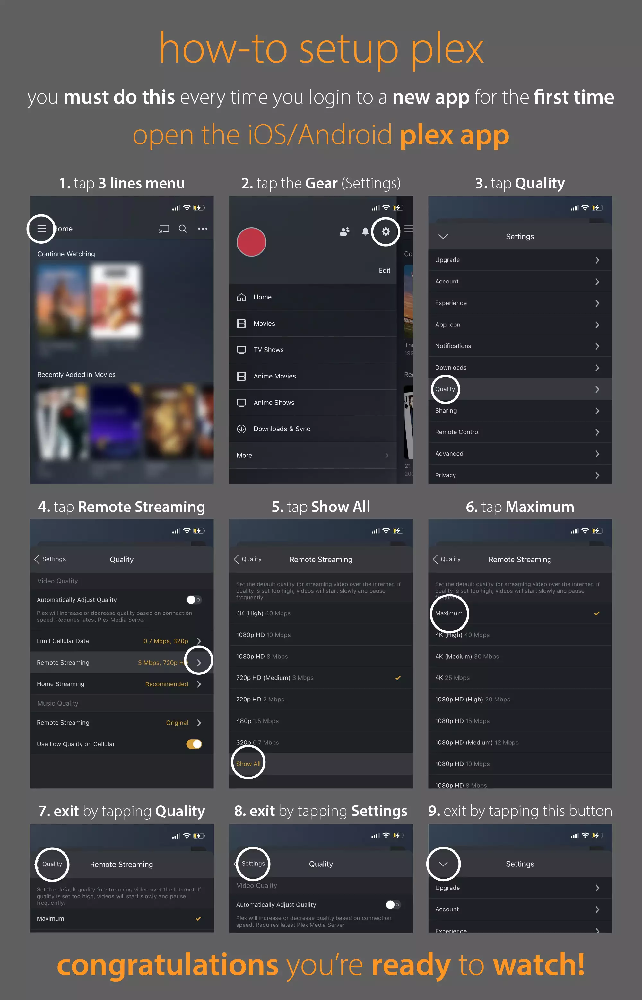
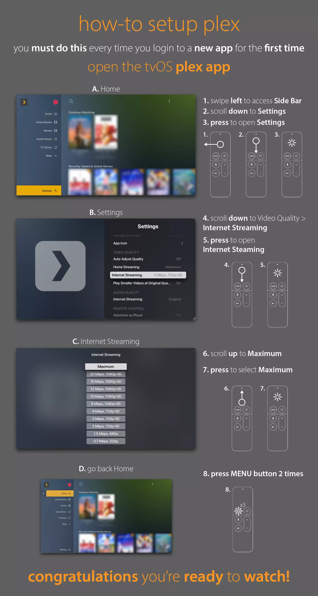

By default, Plex automatically sets video quality to 720p on all new devices. While this conservative setting ensures broad compatibility, it's not optimal for several reasons:

1. Most devices today can handle higher quality streams, such as 4K
2. Downscaling 1080p content to 720p, or 4K to 720p, reduces video quality for the viewer
3. [Transcoding](../faq/what-is-transcoding.md) (converting) video from 4K to 720p creates unnecessary load on the Plex server

!!! tip
    For the best viewing experience, you should adjust your quality settings to "Maximum" or at least "1080p" if your internet connection can support it. The sections in the table of contents to your left will show you how to do this on different devices.

!!! note
    You'll need to change this setting once for each new Plex app you use (phone, TV, web browser, etc.). After that, the setting will be remembered for that device.

See the below instructions for how to change your Plex streaming quality on all applicable platforms.

## iOS & Android

!!! example "iOS & Android"

    

    **Source**: [plxplainers.xyz](https://www.plxplainers.xyz/)

## Streaming Devices

!!! example "Amazon Fire TV, Android TV, PlayStation 4/5, Xbox, Roku, Smart TV (LG, Samsung, VIZIO)"

    

    **Source**: [plxplainers.xyz](https://www.plxplainers.xyz/)

## Plex App

!!! tip
    Plex has a [dedicated app](https://www.plex.tv/en-au/media-server-downloads/?cat=plex+desktop&plat=windows#plex-app) that should be used in place of a web browser when watching Plex on a Windows or Mac PC. The process of changing streaming quality is, however, the same as doing so on a web browser.

!!! example "Plex app"

    

    **Source**: [plxplainers.xyz](https://www.plxplainers.xyz/)

## tvOS (AppleTV)

!!! example "tvOS (Apple TV)"

    

    **Source**: [plxplainers.xyz](https://www.plxplainers.xyz/)

## Web Browser

!!! tip
    Plex has a [dedicated app](https://www.plex.tv/en-au/media-server-downloads/?cat=plex+desktop&plat=windows#plex-app) that should be used in place of a web browser when watching Plex on a Windows or Mac PC. The Plex App provides the same interface as a web browser, but has better playback compatibility and additional features.

!!! example "Web Browser"

    

    **Source**: [plxplainers.xyz](https://www.plxplainers.xyz/)
