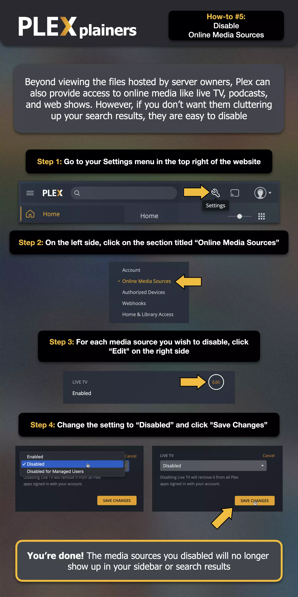

Plex offers additional services like Live TV, Music, and Web Shows that you may see in your sidebar. If you're only interested in accessing bitpushr.net's libraries, you can disable or unpin these extra services to keep your interface clean and focused as in the below how-to. This can be done through your Plex application settings and helps prevent confusion.

!!! example "How-to: Disabling Online Media Sources"

    

    **Source**: [plxplainers.xyz](https://www.plxplainers.xyz/)
