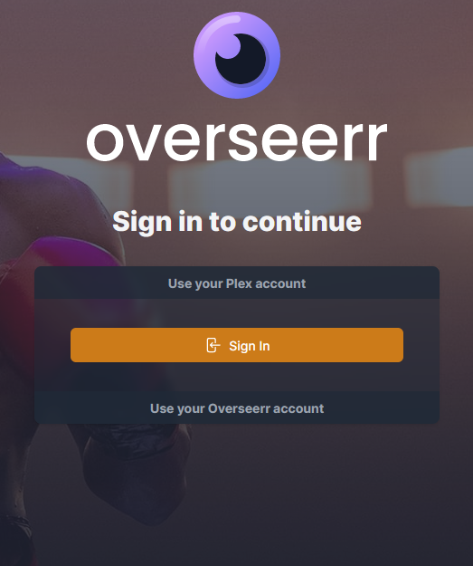
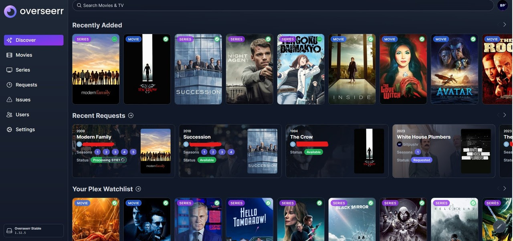

## Welcome

If you're reading this, you have likely just signed up for access to the bitpushr.net Plex server. If this is true, welcome and thanks! This page serves as a sort of landing page for new and existing users alike, providing quick links to things you might need whether you're just starting out or a veteran user. Read on below to equip yourself with the things you'll need to manage and take advantage of the Plex ecosystem features included with your access.

## Plex and Getting It

By now, you already know what Plex *itself* is. Now, you need to actually get it. Plex is available on virtually all platforms whether you're watching via a web browser, a Smart TV, using the Plex desktop app on a Windows or Mac PC, on a mobile device or even a console.

### Plex on Consoles

Plex is available for both Xbox and PlayStation consoles from their respective platform stores. Simply search "Plex".

### Plex on Mobile

Plex is available for both Android and iDevices. Plex for Android can be downloaded via the Google Play store by either searching for it or by using [this](https://play.google.com/store/apps/details?id=com.plexapp.android&#038;hl=en) link. Plex for iDevices (iPhones, iPads, etc.) can be downloaded via the App Store by either searching for it or by using [this](https://apps.apple.com/us/app/plex-watch-live-tv-and-movies/id383457673) link.

### Plex on PC

Plex is available on [Windows](https://www.plex.tv/en-au/media-server-downloads/?cat=plex+desktop&plat=windows#plex-app), [macOS](https://www.plex.tv/en-au/media-server-downloads/?cat=plex+desktop&plat=macos#plex-app) and [Linux-based](https://www.plex.tv/en-au/media-server-downloads/?cat=plex+desktop&plat=linux#plex-app) PCs as a dedicated, standalone app. This is recommended as outlined [here](changing-stream-quality#plex-app.md) for an optimal viewing experience.

### Plex on Streaming Devices

Plex is available on almost all streaming devices including supported [Smart TVs](https://support.plex.tv/articles/204080173-which-smart-tv-models-are-supported/), Chromecast/Google TV, Apple TV and more. In most cases, Plex is available on the platform's respective store simply by searching for "Plex".

### Plex on a Web Browser

Plex is available as a standard webpage [here](https://app.plex.tv/desktop). As above, streaming via a dedicated app is recommended.

## Overseerr

[Overseerr](https://overseerr.dev/) is the request management and media discovery tool that allows bitpushr.net Plex server users to search for and request content to be added, see trending, upcoming and related content and more. You can request new Movies or Shows by visiting Overseerr to make direct requests. To access it, as with this wiki, you login using your Plex account.

Overseerr is mobile-friendly and should be accessible via anything that has a *standalone* web browser such as Google Chrome, Microsoft Edge, Mozilla Firefox, Safari, Brave, etc.

!!! important
    Overseerr is **not** accessible via apps such as Facebook Messenger, as apps such as it do not allow for login/session credentials to be saved

To access and login to Overseerr, go to https://overseerr.bitpushr.net or follow [this](https://overseerr.bitpushr.net) link. There, you'll be greeted by a login screen that looks something like this:

Click/tap the Yellow "Sign In" button on the page under the "Use your Plex account". Another tab (or window if on Mobile) will open that looks like the below image. Login to your Plex account using either your Email details or relevant Google/Facebook/Apple account linked to your Plex account. After doing so, the opened tab/window will close and return you to Overseerr.

!!! tip
    If you setup 2-factor authentication on your Plex account, which we recommend doing, you will be asked to enter your code after logging in.

Once you are logged in, you will be greeted by the Overseerr main interface which looks like the below image.

 When you've reached this step, you're ready to start using Overseerr and can continue to the next section of this page for further instructions on how to request content.

### Requesting Media

Requesting media with Overseerr is pretty simple. To do so, simply search for the name of a movie or show in the "Search Movies & TV" box at the top of the screen. Overseerr will search for and show results of what you have searched, like so:

To request the media to be added to Plex, simply navigate to the correct search result and click/tap on it to enter it. If the media is already on Plex, the page will look something like this:

Here we can see that The Simpsons is already on Plex. Overseerr will show you

- Information about the show including year, rating, number of seasons, genres and an overview

- The status of every season for the show and whether it's available, missing or processing on Plex

- A "Play on Plex" button in the top right to take you directly to the show on Plex

- A yellow "Report issue" button which you can use to report issues with the media, e.g. playback issues

- Further down the page it will also show the show's cast, recommendations for similar shows and more.

In the case of something that is not yet on Plex, the page will look like the below.

Here we can see that The Simpsons Movie isn't yet on Plex. Overseerr is showing us the same information as the previous page, however instead of the "Play on Plex" button we have a Purple "Request" button. Let's request to add this movie to Plex. To do so, simply click or tap on the Purple "Request" button. The page will then show the following, simply hit the "Request" button as below and your request will be submitted.

Give it a moment or two, and the status should change to "Processing" with a spinning circle wheel and a progress bar, as below.

Once the media is processed and added to Plex, the status will change to a Green "Available". This means the media is ready for you to stream on Plex. Sure enough if we go into Plex, The Simpsons Movie is now available to stream.

Plex will automatically scan libraries for new content every 30 minutes so don't worry if your media doesn't immediately show in Plex. As long as your request is successful and the status has changed to "Processing" it should simply be a matter of waiting. In most cases, movies will show on Plex soon after being requested or becoming available if they were previously requested. New releases of existing content already on the bitpushr.net Plex server, for example the release of new seasons or episodes of existing shows, are automatically made available as soon as possible.

!!! note
    There is currently an issue preventing automatic approval and processing of shows, these are manually approved by bitpushr. Once you request a show to be added simply wait for the status to change on Overseerr. Large shows with a lot of episodes or seasons can take longer to be added but will still show on Plex and Overseerr as they become available.

### What else can I do?

You can view trending and popular media, browse media by genre/studio/etc. and view upcoming releases, browse media by network and more. Note that if the icons for media have a Purple clock icon on them, they have been requested to be added but are an upcoming release. Media with a Green tick on the icon has already been added to Plex.

### Additional Information

For more details about requesting content, check out these FAQ pages:

- [Responsible Content Requesting](../faq/responsible-content-requests.md) - Understanding how the server works and best practices when requesting content
- [I requested something an hour ago but it hasn't shown up yet. Why?](../faq/missing-requests.md) - Release dates and availability within [Overseerr](https://overseerr.bitpushr.net)
- [I'm having a problem with a Movie or Show](../faq/content-issues.md) - Reporting issues with Movies or Shows
- [Content Quality and Language Options](../faq/special-requests.md) - Media quality defaults, language tracks, and special content requests
- [I don't want to use this request thingy, can't I just tell you what I want?](../faq/i-dont-want-to-use-overseerr.md) - Why we use a request system.
