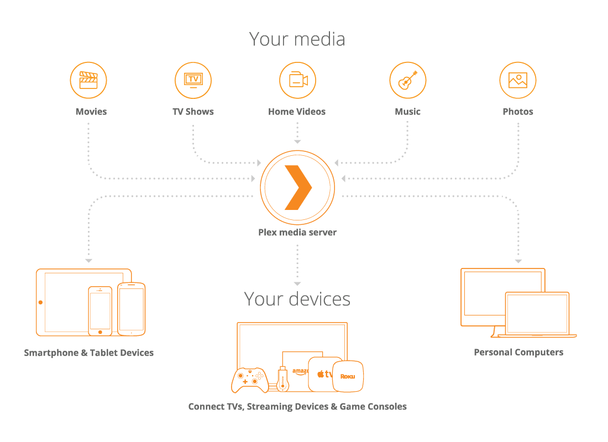

Plex gives you one place to find and access all the media that matters to you. From personal media on your own server or one you're invited to join, to free and on-demand Movies & Shows or live TV, to streaming music, you can enjoy it all in one app, on any device for your very own personal Netflix (or Spotify)-like service.

When the Plex Media Server installed on a server, like with bitpushr.net's, it enables a polished interface for watching Movies, TV Shows and more from any device whether you're at home or away. By joining my Plex server, you're granted shared access to my media library without needing to set up or maintain your own server or media collection.

    **Source**: [Plex: What is Plex?](https://support.plex.tv/articles/200288286-what-is-plex/)
